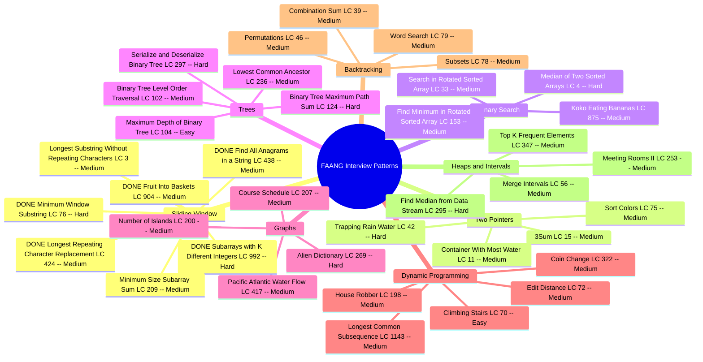
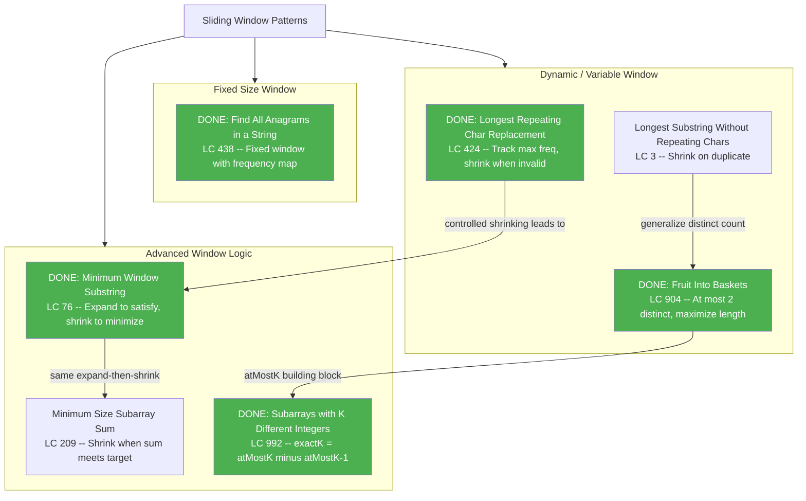

# FAANG Interview Prep -- Mindmap

You have already solved 5 problems. There are about 35 left. That is it. No 120-problem marathon, no sub-sub-categories to get lost in. Just the problems that actually show up in interviews at Google, Meta, Amazon, Apple, and Netflix.

Work through one category at a time. Mark problems DONE as you go. You have already conquered the hardest sliding window problems -- everything else builds on skills you are developing right now.

---

## 1. Start Here -- The Only Map You Need

This is the full scope. Eight categories with 3-7 problems each. If you can solve every problem on this map, you are ready.

---

## 2. Sliding Window Detail Map

You have already finished the hardest problems in this category. This diagram shows how they connect and where the two remaining problems fit in.

---

## 3. Progress and Legend

### Legend

| Marker | Meaning |
|---|---|
| `DONE` in mindmap | Problem completed |
| Green node in detail map | Problem completed |
| `LC ###` | LeetCode problem number |
| Easy / Medium / Hard | Difficulty level |

### Progress: 5 of 40 problems completed

- [x] Find All Anagrams in a String (LC 438) -- Sliding Window
- [x] Longest Repeating Character Replacement (LC 424) -- Sliding Window
- [x] Fruit Into Baskets (LC 904) -- Sliding Window
- [x] Minimum Window Substring (LC 76) -- Sliding Window
- [x] Subarrays with K Different Integers (LC 992) -- Sliding Window
- [ ] Longest Substring Without Repeating Characters (LC 3) -- Sliding Window
- [ ] Minimum Size Subarray Sum (LC 209) -- Sliding Window
- [ ] 3Sum (LC 15) -- Two Pointers
- [ ] Container With Most Water (LC 11) -- Two Pointers
- [ ] Trapping Rain Water (LC 42) -- Two Pointers
- [ ] Sort Colors (LC 75) -- Two Pointers
- [ ] Search in Rotated Sorted Array (LC 33) -- Binary Search
- [ ] Find Minimum in Rotated Sorted Array (LC 153) -- Binary Search
- [ ] Koko Eating Bananas (LC 875) -- Binary Search
- [ ] Median of Two Sorted Arrays (LC 4) -- Binary Search
- [ ] Maximum Depth of Binary Tree (LC 104) -- Trees
- [ ] Binary Tree Level Order Traversal (LC 102) -- Trees
- [ ] Lowest Common Ancestor (LC 236) -- Trees
- [ ] Binary Tree Maximum Path Sum (LC 124) -- Trees
- [ ] Serialize and Deserialize Binary Tree (LC 297) -- Trees
- [ ] Number of Islands (LC 200) -- Graphs
- [ ] Course Schedule (LC 207) -- Graphs
- [ ] Pacific Atlantic Water Flow (LC 417) -- Graphs
- [ ] Alien Dictionary (LC 269) -- Graphs
- [ ] Climbing Stairs (LC 70) -- Dynamic Programming
- [ ] House Robber (LC 198) -- Dynamic Programming
- [ ] Coin Change (LC 322) -- Dynamic Programming
- [ ] Longest Common Subsequence (LC 1143) -- Dynamic Programming
- [ ] Edit Distance (LC 72) -- Dynamic Programming
- [ ] Subsets (LC 78) -- Backtracking
- [ ] Permutations (LC 46) -- Backtracking
- [ ] Combination Sum (LC 39) -- Backtracking
- [ ] Word Search (LC 79) -- Backtracking
- [ ] Find Median from Data Stream (LC 295) -- Heaps and Intervals
- [ ] Merge Intervals (LC 56) -- Heaps and Intervals
- [ ] Meeting Rooms II (LC 253) -- Heaps and Intervals
- [ ] Top K Frequent Elements (LC 347) -- Heaps and Intervals

### Suggested Study Order

1. **Finish Sliding Window** -- Two problems left. You are almost done with an entire category.
2. **Two Pointers** -- Closely related to sliding window. The mechanics will feel familiar.
3. **Binary Search** -- Small category, high return. Shows up in every interview loop.
4. **Trees** -- Recursive thinking that builds directly into graphs and DP.
5. **Graphs** -- BFS/DFS patterns from trees extend here naturally.
6. **Dynamic Programming** -- Start with Climbing Stairs and House Robber, then build up.
7. **Backtracking** -- Formulaic once you see the template. Quick wins.
8. **Heaps and Intervals** -- Round out your toolkit for system-design-adjacent questions.

### How to Use This File

1. Render the Mermaid diagrams in VS Code (Mermaid extension), GitHub preview, or mermaid.live.
2. Work through categories in the suggested order above.
3. When you finish a problem, add `DONE` to its mindmap node and check the box in the progress list.
4. When you complete a full category, create a detail map for it (like the Sliding Window one) to cement the relationships.
